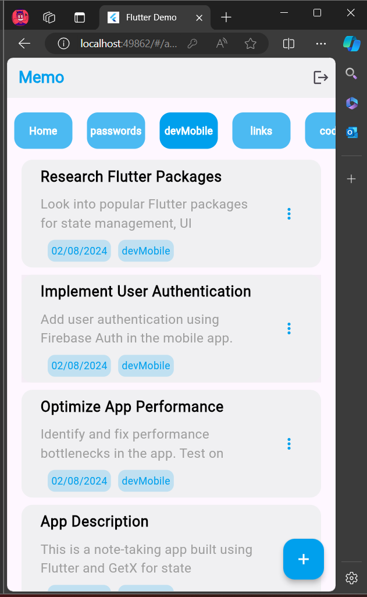
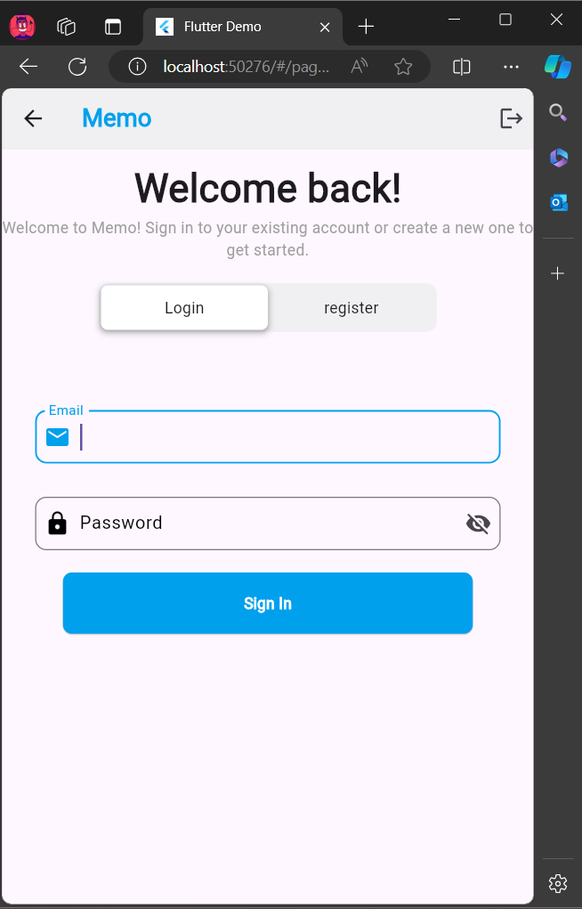
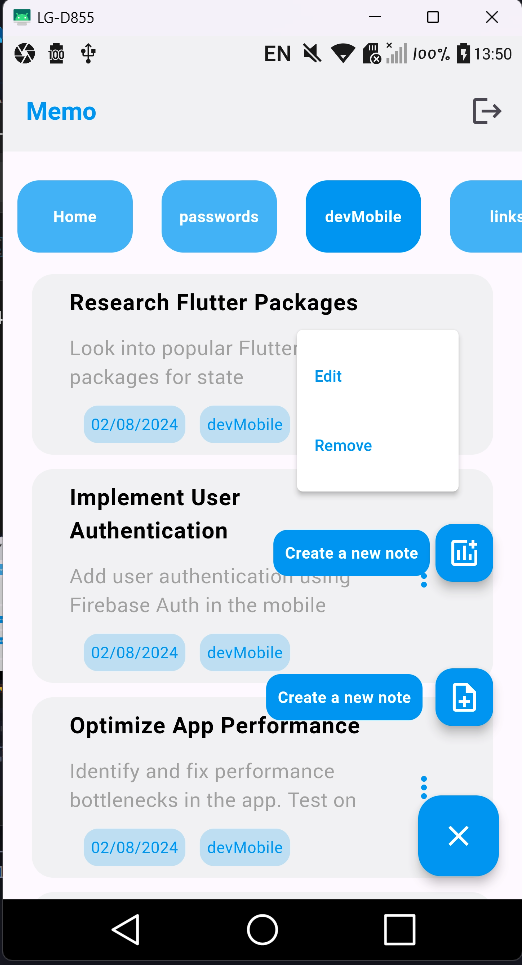
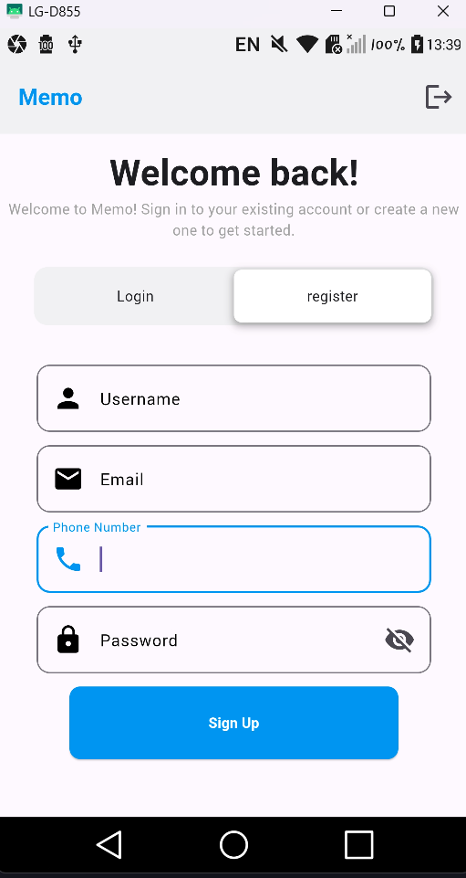

# Key Features:
* Create custom categories to organize your notes based on subjects, projects, or themes.
* User authentication.
* Save authentication state.
* Loading indicators for a smooth user experience.
* Attach notes to specific categories for easy categorization.
* User-friendly interface for seamless navigation.
* Quick access buttons for adding new categories and notes.
* View, edit, or delete individual notes.

## :eyes: App Screenshots:
* **Web:**
  
  
* **Mobile:**
  
  
* **Demo:**
  [Watch the demo video](https://github.com/user-attachments/assets/42cd7f7b-1e09-4a25-ae10-3f0ac1bffb12)
